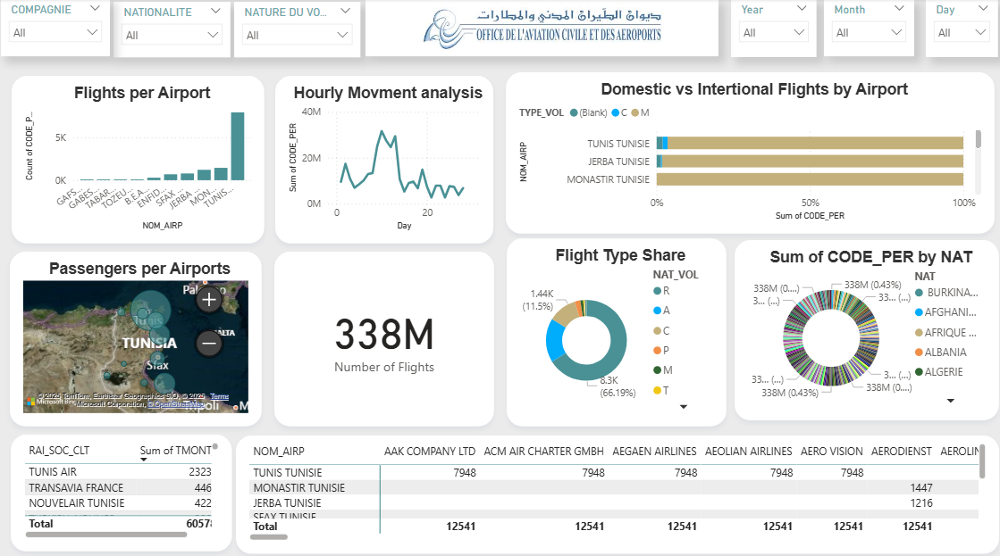

OACA Projects (Office de L'Aviation Civile et Aéroports)
💰 Financial Analysis Dashboard - Tunisian Airline Company
📊 Revenue analysis and financial performance for Tunisian civil aviation
🎯 Project Context
Comprehensive financial analysis Power BI dashboard for a Tunisian airline company, enabling revenue tracking, performance by airport site, and customer analysis.

📈 Integrated Dashboards
1. Main Dashboard - Financial Analysis

Key KPIs:
57M : Total revenue generated
2,050 : Client companies
10 : Airport sites
8389 : Invoices processed

Key Analyses:
Top clients by revenue (Tunis Air, Transavia, Nouvelair, etc.)
Revenue distribution by airport site
Payment methods (cash, credit, AM)
Performance by airline company

2. Conclusion Dashboard - Trends and Perspectives

Advanced Analyses:
Revenue evolution 2017-2020
Freight volume by type
Comparative performance by site code
Air traffic indicators

🏗️ Data Structure Analyzed
Financial Metrics:
TMONT_HT : Amount excluding tax
TMONT_TTC : Amount including tax
CODE_PER : Accounting periods
FRET : Air freight revenue

Analysis Dimensions:
By airline company (Tunis Air, Emirates, Saudi Arabian, etc.)
By airport site (Tunis-Carthage, Monastir, Sfax, Djerba)
By payment method (Cash, Credit)
By time period (2017-2020)

🛠️ Technical Implementation
Tool: Microsoft Power BI
Sources: Operational financial data
Frequency: Real-time and historical analysis
Interactivity: Cross filters, drill-down, tooltips

📊 Business Insights Discovered
Client Performance:
Tunis Air : Main client with highest revenue
International airlines : Emirates, Turkish Airlines, Saudi Arabian
Geographic distribution : European, Middle Eastern, African clients
Operational Performance:
Main site : Tunis-Carthage International Airport
Seasonal trends visible across 2017-2020
Payment method diversity with predominance of credit terms

🎓 Skills Developed
Financial Analysis:
Multi-dimensional revenue analysis
Complex financial KPI calculation
Profitability analysis by segment
Power BI Techniques:
Relational data model
Advanced DAX measures
Interactive visualizations
Professional dashboarding

Aviation Sector:
Understanding of civil aviation metrics
Airport revenue analysis
Airline benchmarking

🚀 Business Usage
For financial management:
Daily revenue tracking
Performance analysis by site
Identification of top clients
Market trend detection
For corporate strategy:
Pricing optimization
Resource allocation by site
Target client development

🔍 Strategic Analysis - Key Insights
Top Performers:
Tunis Air represents the most lucrative client segment
Tunis-Carthage Airport generates the main business volume
Credit payment : Dominant mode (cash flow analysis)

Business Recommendations:
Growth focus on Middle-East airlines (Emirates, Saudi)
Cost optimization at secondary sites
Freight service development (identified potential)

Real Impact:
Decision support for financial management
Performance visualization for the board of directors
Management tool for site managers

Project Context
This dashboard was designed to offer a comprehensive analysis of air traffic and airport operations. It enables visualization and study of flight patterns, passenger distribution, and airline trends.

3. Main Dashboard - Airport Analysis

Key Features ✨
Airport Overview: 🗺️ Compares number of flights and passengers by airport (Tunis, Djerba, Monastir, etc.)
Temporal Analysis: ⏰ Highlights peak periods and flight movement trends on an hourly basis
Key Segmentations: ✈️ Differentiates domestic flights from international flights and analyzes the contribution of different airlines
This tool is ideal for obtaining quick insights into airport performance and air traffic dynamics.

