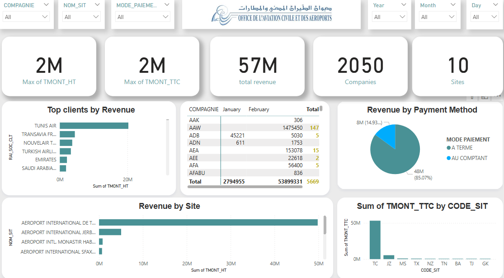
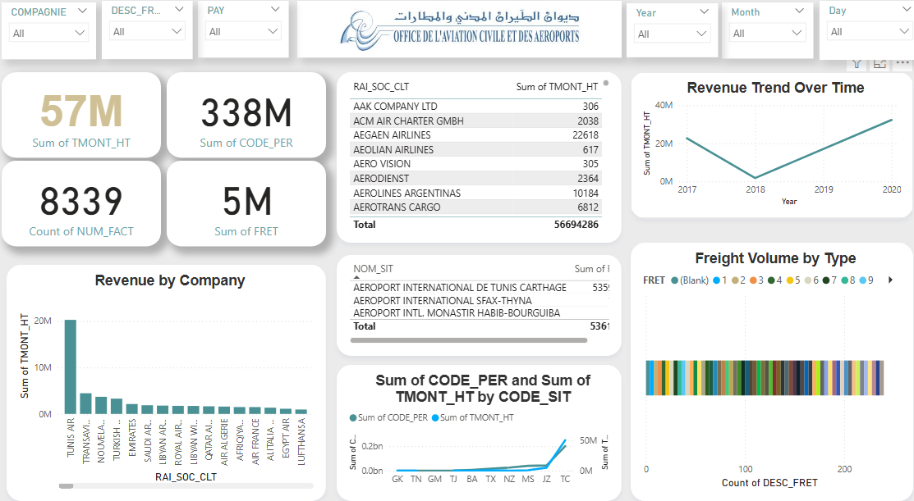

# Projets OACA (Office de L'Aviation Civile et Aéroports
# 💰 Dashboard d'Analyse Financière - Compagnie Aérienne Tunisienne

## 📊 Analyse des revenus et performance financière pour l'aviation civile tunisienne

### 🎯 Contexte du Projet
Dashboard Power BI d'analyse financière complète pour une compagnie aérienne tunisienne, permettant le suivi des revenus, la performance par site aéroportuaire et l'analyse clientèle.

### 📈 Tableaux de Bord Intégrés

#### **1. Dashboard Principal - Analyse Financière**

**KPI Principaux :**
- **57M** : Revenu total généré
- **2,050** : Entreprises clientes
- **10** : Sites aéroportuaires
- **8389** : Factures traitées

**Analyses Clés :**
- **Top clients** par chiffre d'affaires (Tunis Air, Transavia, Nouvelair, etc.)
- **Répartition des revenus** par site aéroportuaire
- **Modes de paiement** (comptant, à terme, AM)
- **Performance** par compagnie aérienne

#### **2. Dashboard Conclusion - Tendances et Perspectives**

**Analyses Avancées :**
- **Évolution des revenus** 2017-2020
- **Volume de fret** par type
- **Performance comparative** par code site
- **Indicateurs de trafic** aérien

### 🏗️ Structure des Données Analysées

#### **Metrics Financières :**
- `TMONT_HT` : Montant hors taxes
- `TMONT_TTC` : Montant toutes taxes comprises
- `CODE_PER` : Périodes comptables
- `FRET` : Revenus fret aérien

#### **Dimensions d'Analyse :**
- **Par compagnie aérienne** (Tunis Air, Emirates, Saudi Arabian, etc.)
- **Par site aéroportuaire** (Tunis-Carthage, Monastir, Sfax, Djerba)
- **Par mode de paiement** (Comptant, À terme)
- **Par période temporelle** (2017-2020)

### 🛠️ Réalisation Technique

**Outil :** Microsoft Power BI  
**Sources :** Données financières opérationnelles  
**Fréquence :** Analyse temps réel et historique  
**Interactivité :** Filtres croisés, drill-down, tooltips

### 📊 Insights Business Découverts

#### **Performances Clients :**
- **Tunis Air** : Client principal avec le plus haut chiffre d'affaires
- **Compagnies internationales** : Emirates, Turkish Airlines, Saudi Arabian
- **Répartition géographique** : Clients européens, moyen-orientaux, africains

#### **Performance Opérationnelle :**
- **Site principal** : Aéroport International de Tunis-Carthage
- **Tendances saisonnières** visibles sur 2017-2020
- **Diversité des modes de paiement** avec prédominance des termes

### 🎓 Compétences Développées

#### **Analyse Financière :**
- Analyse de chiffre d'affaires multi-dimensionnelle
- Calcul de KPI financiers complexes
- Analyse de rentabilité par segment

#### **Techniques Power BI :**
- Modèle de données relationnel
- Mesures DAX avancées
- Visualisations interactives
- Dashboarding professionnel

#### **Secteur Aérien :**
- Compréhension des métriques aviation civile
- Analyse des revenus aéroportuaires
- Benchmarking compagnies aériennes

### 🚀 Utilisation Business

**Pour la direction financière :**
- Suivi quotidien des revenus
- Analyse de la performance par site
- Identification des meilleurs clients
- Détection des tendances marché

**Pour la stratégie d'entreprise :**
- Optimisation de la tarification
- Allocation des ressources par site
- Développement clientèle cible
  ### 🔍 Analyse Stratégique - Insights Clés

#### **Top Performers :**
- **Tunis Air** représente le segment client le plus lucratif
- **Aéroport Tunis-Carthage** génère le volume d'affaires principal
- **Paiement à terme** : Mode dominant (analyse de trésorerie)

#### **Recommandations Business :**
1. **Focus croissance** sur les compagnies Middle-East (Emirates, Saudi)
2. **Optimisation des coûts** sur les sites secondaires
3. **Développement des services fret** (potentiel identifié)

#### **Impact Réel :**
- **Support à la décision** pour la direction financière
- **Visualisation des performances** pour le conseil d'administration
- **Outil de pilotage** pour les managers de sites

